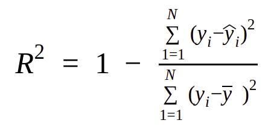

# Testing a model

Once a model is built it can be used to predict values. You can provide new values to see where it would fall on the spectrum, and test the generated model.

## Common classes and functions

- [LinearRegression](https://scikit-learn.org/stable/modules/generated/sklearn.linear_model.LinearRegression.html) fits a linear model
- [LinearRegression.predict](https://scikit-learn.org/stable/modules/generated/sklearn.linear_model.LinearRegression.html?highlight=linearregression#sklearn.linear_model.LinearRegression.predict) is used to predict outcomes for new data based on the trained linear model

## Regression Metrics

Regression metrics are different from classification metrics because we are predicting a continuous quantity. Furthermore, regression typically has simpler evaluation needs than classification.

### Mean Absolute Error

Mean absolute error (MAE) is one of the most common metrics that is used to calculate the prediction error of the model.  
Prediction error of a single row of data is:  
`PredictionError = ActualValue - PredictedValue`  
We need to calculate prediction errors for each row of data, get their absolute value and then find the mean of all absolute prediction errors.  

MAE is given by the following formula:  

A large MAE suggests that your model may have trouble at generalizing well. An MAE of 0 means that our model outputs perfect predictions, but this is unlikely to happen in real scenarios.

### Mean Squared Error

Mean squared error (MSE) takes the mean squared difference between the target and predicted values. This value is widely used for many regression problems and larger errors have correspondingly larger squared contributions to the mean error.  

MSE is given by the following formula:  
  
MSE will almost always be bigger than MAE because in MAE residuals contribute linearly to the total error, while in MSE the error grows quadratically with each residual. This is why MSE is used to determine the extent to which the model fits the data because it strongly penalizes the heavy outliers.  

### The Coefficient of Determination (R^2 score)

`R^2` score determines how well the regression predictions approximate the real data points.  
The value of R2 is calculated with the following formula:  
  
R2 can take values from **0** to **1**. A value of 1 indicates that the regression **predictions perfectly fit** the data.

## Microsoft Learn Resources

Explore related tutorials on [Microsoft Learn](https://learn.microsoft.com/?WT.mc_id=python-c9-niner).

- [Intro to machine learning with Python and Azure Notebooks](https://docs.microsoft.com/learn/paths/intro-to-ml-with-python/?WT.mc_id=python-c9-niner)
